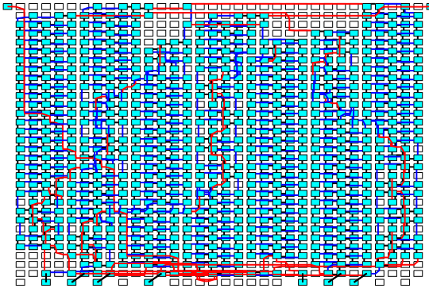
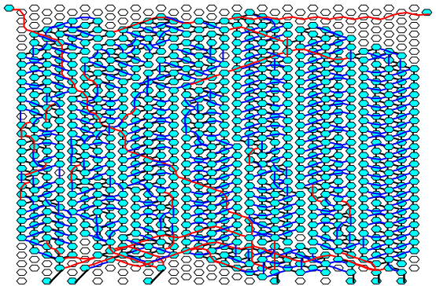

# Mapper2

[](https://travis-ci.org/hildebrandmw/Mapper2.jl)
[](https://codecov.io/gh/hildebrandmw/Mapper2.jl)
[](https://hildebrandmw.github.io/Mapper2.jl/latest)
[](https://www.repostatus.org/#wip)


Welcome to the Mapper2 project. This program was originally intended to serve
as a CAD tool for application development for the KiloCore and KiloCore2
many-core processors, and has since morphed into a more generalized mapping
tool allowing flexible, high speed mappings to arbitrary topologies in arbitrary
dimensions.

## Installation

This package is not a registered Julia package. To install, run the command

```julia
]add https://github.com/hildebrandmw/Mapper2.jl
```

All dependent packages should be installed. To verify the installation, run
the command:

```julia
]test Mapper2
```

## Example Plots

The two plots below show the same taskgraph for different underlying architectures.
Mapper2 is equally capable of mapping to rectilinear architectures, hexagonal architectures, and much more.
Connectivity between mappable elements is not hard-coded, but rather discovered dynamically.
This allows any kind of connection you want (hopefully) in the underlying architecture.




## Caveat Emptor
This code is in no way production ready.
At the moment, I am not currently developing Mapper2.jl.
That said, I am still supporting the repo and willing to provide documentation, bug fixes, and features requests (within reason).
Since this was research code, there are still some areas that are rough around the edges, but the code is functional for its intended use case.

If you have any question, comments, requests etc., feel free to open an issue or contact me directly. I'm happy to help!
